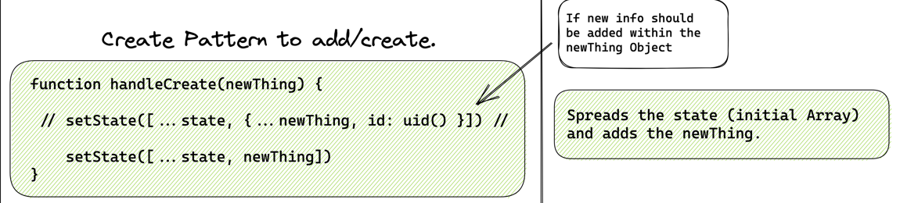
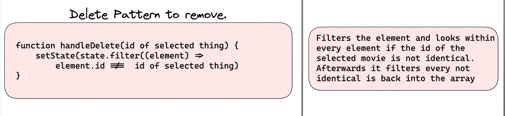
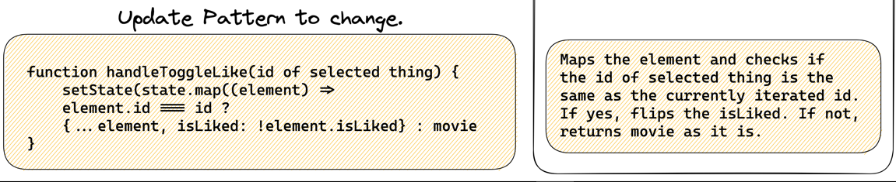
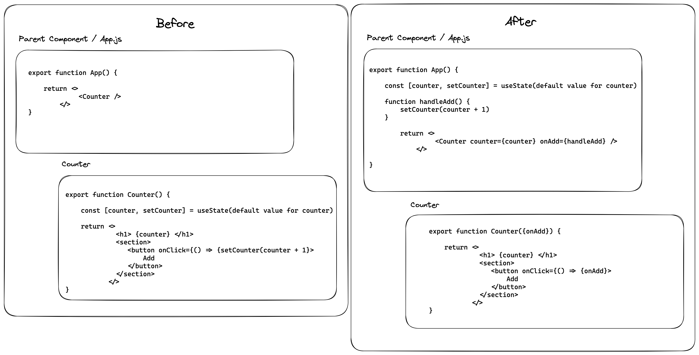

# Cheat Sheet for Prio 1

## Git and GitHub Workflow

- Branches for every new feature
- Regularly commit changes with detailed commit message
- Let the coaches review your Pull Requests

## Array functions

### Array.forEach

- The array method `forEach()` executes some logic for each element within an array
- does not return a new array
- example:

```javascript
const pets = ["bird", "cat", "dog", "ferret", "fish"];
pets.forEach((pet) => {
  const petElement = document.createElement("p");
  petElement.textContent = pet;
  document.body.append(petElement);
});
```

### Array.filter

- The array method `filter()` is used to create a new array with just the elements from the original array, that pass the test implemented by the provided function.
- example:

```javascript
const pets = ["bird", "cat", "dog", "ferret", "fish"];
const petsWithF = pets.filter((pet) => {
  return pet.startsWith("f");
});
console.log(petsWithF); // ['ferret', 'fish']
```

### Array.map

- The array method `map()` is used to apply a transformation to each element of an array
- The transformed elements are stored in the newly created array returned by map
- example:

```javascript
const pets = ["bird", "cat", "dog", "ferret", "fish"];
const uppercasePets = pets.map((pet) => {
  return pet.toUpperCase();
});
console.log(uppercasePets); // ['BIRD', 'CAT', 'DOG', 'FERRET', 'FISH']
```

### Array.find

- Use `find()` to receive the first element of the array that satisfies the provided testing function. Otherwise, it returns undefined
- example:

```javascript
const colors = ["hotpink", "aquamarine", "granite", "grey"];

colors.find((color) => color.startsWith("g")); // 'granite'
colors.find((color) => color.startsWith("b")); // undefined
```

## Spread & Rest operators

### Rest Operator

- The rest syntax allows you to say: "Put the rest into this variable" when using destructuring assignment or declaring function parameters
- example:

```javascript
const greekLetters = ["alpha", "beta", "gamma", "delta"];
const [firstLetter, ...allTheOtherLetters] = greekLetters;
// firstLetter → "alpha"
// allTheOtherLetters → ["beta", "gamma", "delta"]
```

### Spread Operator

- The spread syntax allows you to say: "spread everything inside this variable into here" when declaring array or object literals or calling functions.
- example:

```javascript
const greekLetters = ["alpha", "beta", "gamma", "delta"];
const moreGreekLetters = [...greekLetters, "epsilon", "zeta"];
// moreGreekLetters → ['alpha', 'beta', 'gamma', 'delta', 'epsilon', 'zeta']
```

## useState

- State is data that changes over time. Think of the lamp on you desk. It can be switched on or switched of. The lamp is in a particular state at a given time and that state can change over time.
- In React we work with state by using the useState hook function
- A React component can have multiple states. You can use the useState function as much as you need.
- To handle state in React we can not simply use a "normal" variable and assign a new value. React needs to be informed that the data was changed

```javascript
import { useState } from "react";

function SocialMediaPost() {
  const [liked, setLiked] = useState(false);

  function toggleLiked() {
    setLiked(!liked);
  }

  return (
    <article>
      <p>Liked: {liked ? "Yes" : "No"}</p>
      <button type="button" onClick={toggleLiked}>
        {liked ? "Remove like" : "Add like"}
      </button>
    </article>
  );
}
```

## State handling patterns (create, update, delete)

### Create Pattern



### Delete Pattern



### Update Pattern



## useEffect (reacting on state change)

The useEffect hook is used to add effects to a React component. It takes two arguments:

- a function that defines the effect (usually an anonymous function)
- an array of variables that the effect depends on
- example:

```js
import { useEffect, useState } from "react";

function Jokes() {
  const [jokes, setJokes] = useState([]);

  useEffect(() => {
    async function startFetching() {
      const response = await fetch(
        "https://example-apis.vercel.app/api/bad-jokes"
      );
      const jokes = await response.json();

      setJokes(jokes);
    }

    startFetching();
  }, []);

  return (
    <ul>
      {jokes.map(({ id, joke }) => (
        <li key={id}>{joke}</li>
      ))}
    </ul>
  );
}
```

## React State uplifting



## fetch

### Some small comments:

- starts wihtin the first argument of the useEffect hook
- needs a async function,
  error handling through a try and catch block,
  await fetching and the conversion of the data into .json()
- dependency array (second argument of the useEffect hook) sets the condition of reloading.

## localStorage

- we're using the use-local-storage-state library from npm
- you can use it as a drop-in replacement for the useState hook (commented out in the example below).
- the first argument is the key under which the browser will store the data. The second argument starts with the defaultValue and is required.

```js
// import { useState } from "react";
import useLocalStorageState from "use-local-storage-state";

function Counter() {
  // const [count, setCount] = useState(0);
  const [count, setCount] = useLocalStorageState("count", { defaultValue: 0 });

  return (
    <div>
      <p>Count: {count}</p>
      <button onClick={() => setCount(count + 1)}>Increment</button>
    </div>
  );
}
```

## Next file based routing (useRouter)

Routing in Next.js is based on the file system in the pages folder:

- `pages/index.js → / `(index.js always implies the root route of a folder)
- `pages/about.js → /about`

To support more complex routes, you can create the appropriate nested folder structure:

- `pages/about/me.js → /about/me`
- `pages/about/all-others.js → /about/all-others`
- `pages/about/some/long/route.js → /about/some/long/route`

A [slug] leads to all undefined routes which are linked to the url/router. Therefore its perfect for creating detailed pages with slugs or ids within the fetched data.

## Forms (controlled inputs & local state)

### State syntax

```js
import { useState } from "react";

const [state, setState] = useState("insert my default value for state");
```

## conditions (if else, ternary operator)

### if else statement normally

```js
let number = 10;

// the condition which should get tested
if (number > 100) {
  // what code should be executed if true
  number = number - 1;

  // next tested condition
} else if (number < 10) {
  number = number + 1;

  // gets executed if no conditions is met
} else {
  console.log("Your number must be exactly 10");
}
```

### if else statement in ternary syntax

```js
const boolean = true;
/* first the condition ending with '?' then 
what should be returned if the condition is met. 
If the condition is not met then the 
block after ":" gets returned. */
boolean
  ? "Condition is true -> I'm executed :)"
  : "Condition is true -> I'm not executed :(";
```
